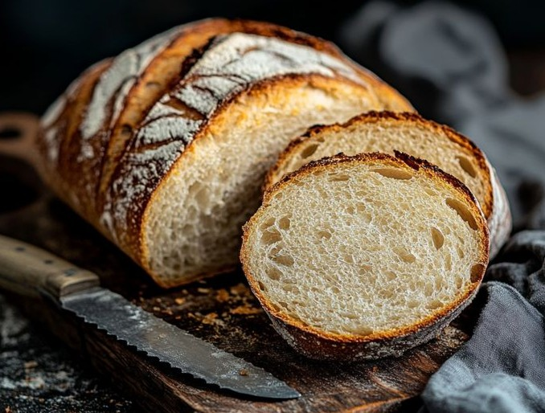

# RoboBake: a Futuristic Bakery Website



A website for **RoboBake**, a made-up bakery where robot bakers make fresh bread 24 hours a day. The site has a neon cyberpunk look, glassy cards, smooth animations, and works on any screen size.

This was a team project for a web programming course. The site content is in Indonesian.

## Features

1. **Hero** with a typing-text effect, a pulsing call-to-action button, and a floating image
2. **About** the robot bakers, with three highlight cards
3. **Products**: a grid of breads with glow and zoom on hover; "Buy now" shows a small pop-up notification
4. **Statistics** that count up when you scroll to them: happy customers, bread types, satisfaction, and opening hours
5. **Testimonials** with star ratings
6. **Contact form** that checks the email and WhatsApp number before sending
7. **Floating particles** in the background that follow your mouse

## Tech stack

HTML, CSS, JavaScript, Bootstrap 5, Font Awesome, and Google Fonts (Orbitron and Rajdhani). Everything loads from a CDN, so there's nothing to install.

## Run it

Open `index.html` in your browser, or use VS Code's **Live Server** extension.

You can also serve it locally:

```bash
python -m http.server 8000
# or
npx http-server
```

Then open http://localhost:8000.

## Customizing

| To change | Edit |
| --- | --- |
| Text | `index.html` |
| Neon colors (`#00ffff` cyan, `#ff00ff` magenta, `#00ff88` green) | `css/style.css` |
| Animation speed | The `duration` values in the CSS keyframes |
| Fonts | The Google Fonts link in `index.html` |
| Particles on/off | The `js/particles.js` script tag in `index.html` |
| Counter animation | The counter section in `js/main.js` |

To add a product, copy one of the product cards in `index.html`:

```html
<div class="col-lg-4 col-md-6">
    <div class="product-card glow-hover sweep-light text-center">
        <div class="product-img-wrapper">
            
        </div>
        <div class="product-body">
            <h5 class="text-white fw-bold mt-3">Product name</h5>
            <p class="price fw-bold fs-3 text-cyan">Price</p>
            <button class="btn btn-outline-cyan w-100 buy-now-btn" data-product="Product name">
                Beli Sekarang
            </button>
        </div>
    </div>
</div>
```

## Project structure

```
index.html          The whole site
ikon.jpeg           Favicon
css/style.css       Styles and animations
js/main.js          Typing effect, counters, form checks, notifications
js/particles.js     Interactive particle background
assets/images/      Product photos (roti_1.jpg to roti_6.jpg) and team photos
```

## Team

| Name | Role |
| --- | --- |
| Panji Uyu | Frontend lead (UI and animation) |
| Rahmat Eka | Full stack |
| Astrid Salwa | Design and branding |

## Ideas for later

Dark/light theme toggle, English and Indonesian versions, online payments, an admin dashboard, and order tracking.

## License

MIT
